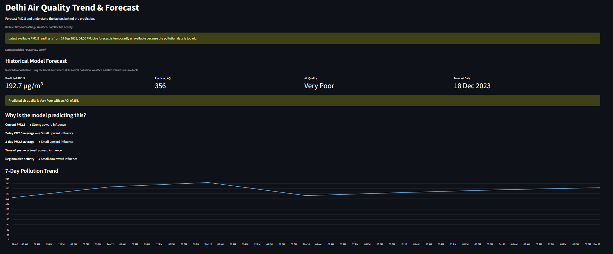
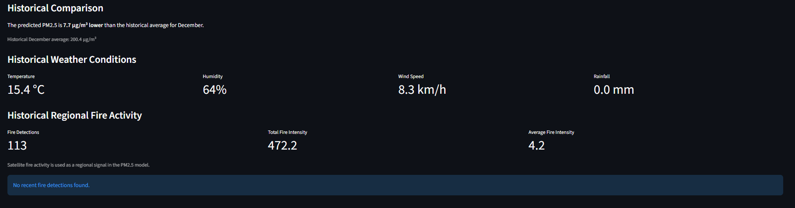

# 🌫️ Delhi Air Quality Trend & Forecast

An end-to-end data science project that analyzes historical air pollution in Delhi and predicts **next-day PM2.5 levels** using pollution history, weather conditions, and regional satellite fire activity.

The project integrates multiple real-world data sources, compares several machine learning models, explains predictions with SHAP, and provides an interactive Streamlit dashboard with live-data integration.

[](https://www.python.org/)
[](https://scikit-learn.org/)
[](https://shap.readthedocs.io/)
[](https://streamlit.io/)

### 🌐 Live Demo
[Open the Live Dashboard](https://delhi-air-quality-forecast.streamlit.app/)

## 📊 Dashboard Preview




---

## 🎯 Project Objective

> **What could Delhi's PM2.5 level be tomorrow, and what factors are influencing the prediction?**

Rather than only displaying a pollution value, the system combines historical PM2.5, weather, regional fire activity, and time-based patterns to forecast next-day PM2.5, explain the drivers behind each prediction, and verify that live data is fresh before presenting a forecast.

---

## 🔄 Workflow

```text
OpenAQ PM2.5  +  Open-Meteo Weather  +  NASA FIRMS Fires
                          ↓
        Data Cleaning & Time-Based Integration
                          ↓
        Exploratory Data Analysis → Feature Engineering
                          ↓
        Time-Aware Split → Baseline → Model Comparison → Tuning
                          ↓
        Final Model → SHAP Explainability
                          ↓
        Live Data Pipeline → Streamlit Dashboard
```

---

## 📊 Data Sources

| Source | Data | Key Fields |
|---|---|---|
| **OpenAQ API** | Historical and live PM2.5 | Daily PM2.5 concentration |
| **Open-Meteo API** | Weather conditions | Temperature, humidity, rainfall, wind speed |
| **NASA FIRMS** | Regional satellite fire activity | Fire count, total FRP, mean FRP |

Datasets are cleaned, standardized, and aligned into a daily time series. Raw data is kept separate from processed modeling data.

---

## 🧠 Feature Engineering

| Category | Features |
|---|---|
| **Pollution** | Current PM2.5, lags (1, 2, 3, 7 days), 3-day and 7-day rolling averages |
| **Weather** | Temperature, humidity, rainfall, wind speed |
| **Fire** | Fire count, total FRP, mean FRP |
| **Time** | Month, day of year |

**Target:** next-day PM2.5 concentration.

---

## ⏳ Time-Aware Validation

Because air-quality data is time-dependent, the dataset is split **chronologically rather than randomly** to prevent future information from leaking into training.

| Split | Rows | Period |
|---|---|---|
| Training | 1,892 | 16 Nov 2016 → 05 Jul 2022 |
| Testing | 474 | 06 Jul 2022 → 17 Dec 2023 |

---

## 📈 Model Performance

Eight approaches were compared, including a persistence baseline (tomorrow = today), Linear Regression, Random Forest, and LightGBM variants.

| Model | MAE | RMSE | R² |
|---|---:|---:|---:|
| Persistence Baseline | 21.36 | 35.67 | 0.808 |
| Linear Regression | 28.86 | 40.99 | 0.747 |
| Random Forest | 27.73 | 44.95 | 0.696 |
| LightGBM | 34.52 | 55.29 | 0.540 |
| Improved Random Forest | 21.48 | 35.79 | 0.807 |
| Improved LightGBM | 27.99 | 45.58 | 0.687 |
| Random Forest (no fire features) | 21.56 | 36.47 | 0.800 |
| **Tuned Random Forest** ✅ | **21.11** | **33.73** | **0.829** |

The **Tuned Random Forest** was selected as the final model, achieving **MAE 21.11 µg/m³**, **RMSE 33.73 µg/m³**, and **R² 0.829**.

The persistence baseline is intentionally strong, since today's PM2.5 carries substantial information about tomorrow's level — the tuned model improves on it in both MAE and RMSE.

### 🔥 Fire Feature Experiment

Removing fire features raised RMSE from 33.73 to 36.47 (R² 0.829 → 0.800), suggesting fire activity contains useful predictive signal. This reflects **predictive association, not proof of causation**.

---

## 🔍 Model Explainability

**SHAP** is used to explain individual predictions in a user-friendly form:

```text
Current PM2.5          ↑ Strong upward influence
7-day PM2.5 average    ↑ Moderate upward influence
Wind speed             ↓ Small downward influence
Regional fire activity ↑ Small upward influence
```

This shows which features mattered most, whether they pushed the forecast up or down, and their relative strength. SHAP explains model behavior; it does not prove that a feature caused a pollution level.

---

## 🖥️ Streamlit Dashboard

- **PM2.5 forecast** — predicted PM2.5, AQI, air-quality category, and forecast date
- **Prediction explanation** — top SHAP-driven factors with upward/downward influence
- **7-day pollution trend** — recent PM2.5 behavior for context
- **Historical comparison** — prediction vs. past PM2.5 for the same month
- **Weather & fire panels** — temperature, humidity, wind, rainfall, and fire intensity
- **Fire hotspot map** — recent NASA FIRMS detections on an interactive map

---

## 🌐 Live Data Pipeline

The application pulls the latest PM2.5 (OpenAQ), current and next-day weather (Open-Meteo), and recent fire activity (NASA FIRMS).

Before generating a live forecast, it checks the **age of the latest PM2.5 observation**. If the reading is too old, the dashboard does not present it as a current prediction and shows a warning instead, while the historical model demonstration remains available. This prevents stale API data from being passed off as a live forecast.

---

## 🛠️ Tech Stack

| Category | Tools |
|---|---|
| Language | Python |
| Data Analysis | Pandas, NumPy |
| Machine Learning | Scikit-learn (Random Forest), LightGBM |
| Explainability | SHAP |
| Data Sources | OpenAQ API, Open-Meteo API, NASA FIRMS |
| Dashboard | Streamlit |
| Model Storage | Joblib |

---

## ⚙️ Getting Started

**1. Clone the repository**

```bash
git clone https://github.com/AayushSingh098/air-quality-trend-forecast.git
cd "Air Quality Trend & Forecast"
```

**2. Create and activate a virtual environment**

```bash
python -m venv .venv
.venv\Scripts\activate        # Windows
source .venv/bin/activate     # macOS / Linux
```

**3. Install dependencies**

```bash
pip install -r requirements.txt
```

**4. Configure environment variables**

Create a `.env` file in the project root:

```env
OPENAQ_API_KEY=your_openaq_api_key
NASA_FIRMS_MAP_KEY=your_nasa_firms_map_key
```

> 🔒 The `.env` file is excluded via `.gitignore`. Never commit API keys or other secrets.

**5. Run the dashboard**

```bash
streamlit run app/app.py
```

---

## ⚠️ Limitations

- Live forecasting depends on the freshness and availability of OpenAQ data.
- Monitoring stations can have reporting delays or missing observations.
- Extreme pollution spikes are harder for the model to predict accurately.
- Fire activity is a regional predictive signal, not direct causal evidence.
- Performance reflects the available historical dataset and may change under different environmental conditions.
- AQI is derived from predicted PM2.5 for easier interpretation; PM2.5 remains the primary ML target.

---

## 🚀 Future Improvements

- Automatically fall back to another Delhi monitoring station when the primary sensor is stale
- Multi-day PM2.5 forecasting
- More advanced time-series models
- Additional meteorological variables
- Spatial fire features based on distance and wind direction
- Automated data refresh and scheduled model retraining

---

## 💡 Key Learning Outcomes

Real-world API data collection · Multi-source data integration · Time-series preparation · Feature engineering · Time-aware validation · Baseline comparison and model tuning · Feature ablation experiments · Explainable AI with SHAP · Live API integration with data-freshness validation · Interactive dashboard development

---

## 👨‍💻 Author

**Aayush Kumar Singh**
Data Science / Data Analytics Portfolio Project